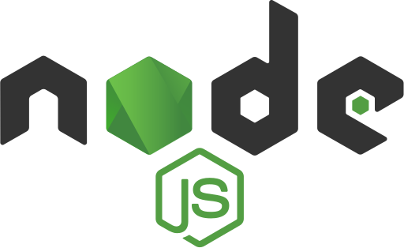

 # Syncora

 A simple, modern name conveying a tech stack-focused project.

## 🚀 Getting Started
 Follow these instructions to get Syncora up and running on your local machine.

### Prerequisites
      

1. Node.js - JavaScript runtime.
2. PNPM - Fast, disk-space-efficient package manager.
3. Turborepo - Tool for managing monorepos.
4. TypeScript - Type-safe language for both backend and frontend.
5. Prisma - ORM for efficient database handling.
6. Docker - Containerization platform for consistent development environments.

## 👨‍💻 About this repository
 - [**`Turborepo`**](https://turbo.build/repo) - Monorepo management for efficient builds and dependency sharing.
 - **`NodeJS`** - Server-side JavaScript runtime.
 - **`ExpressJS`** - Lightweight web framework for the backend API.
 - **`TypeScript`** - Type-safe language for both backend and frontend.
 - **`SvelteKit`** - Modern frontend framework for creating reactive UIs.
 - [**`PNPM`**](https://pnpm.io) - Fast, disk-space-efficient package manager.

## 📂 Project Structure

Here's an overview of the `Syncora` project structure:

```plaintext
syncora
├───.vscode                # VS Code workspace settings
├───apps
│   ├───api                # Backend service (Node.js + Express)
│   └───web                # Frontend service (SvelteKit)
├───assets                 # Icons and images for documentation
└───packages               # Shared packages across apps (e.g., utilities)
```

## 🏃 Quick Start

1. Install dependencies:
```bash
pnpm install
```
2. Build the project:
```bash
pnpm build
```
3. Run the development servers:
```bash
pnpm dev
```

### 🧩 Run a workspace

You can use the `pnpm --filter=[WORKSPACE]` command to start the development process for a workspace.

#### Examples

1. To run the `Syncora` website:

```bash
pnpm --filter=web dev
```

2. To run the `Syncora` api:

```bash
pnpm --filter=api dev
```

## 📜 Available Scripts
These scripts can be run from the project root:
 - `build`: Builds all projects in the monorepo.
 - `dev`: Starts the development servers for all projects.
 - `lint`: Checks for code quality and formatting issues.
 - `lint:fix`: Automatically fixes any linting issues where possible.

## 🤝 Contributing

Please read the [contributing guide](/CONTRIBUTING.md).

## ⚖ License

Licensed under the [MIT license](https://github.com/vani0-0/syncora/blob/main/LICENSE).

## Author
  [Vince^^](https://github.com/vani0-0)
